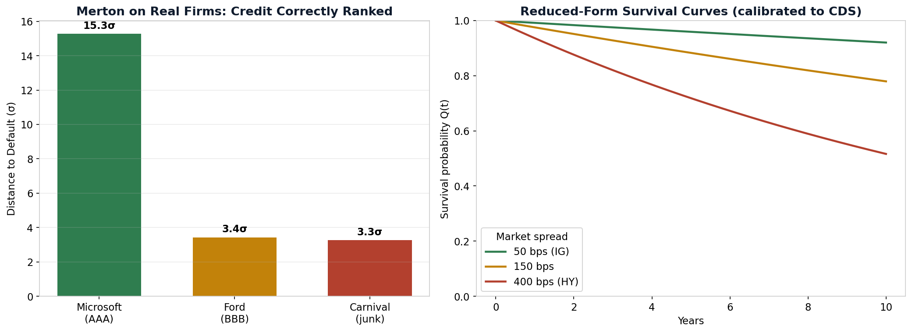
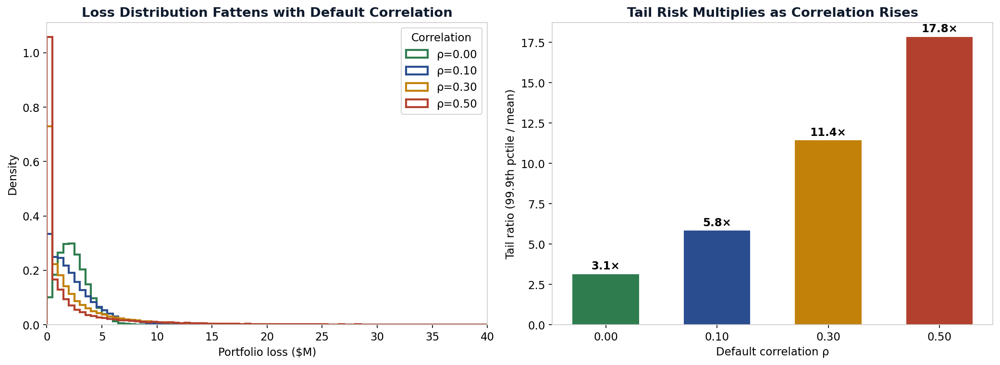
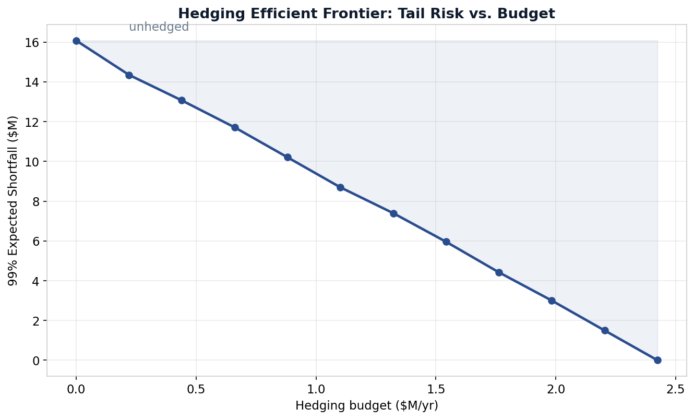

# Integrated Credit Portfolio Analytics & Trading System

A four-layer quantitative system that mirrors the work of a bank's Credit Portfolio Group quant research function: it prices single-name credit risk, measures correlated portfolio losses, optimizes hedges against a budget, and uses an LLM to turn the output into a desk-ready briefing. Built from first principles in Python, validated against real market data, and covered by 44 tests.

The system answers one end-to-end question: **given a book of credit exposures, where is the tail risk, what should we hedge, and what does it cost?**

---

## The four layers

```
Layer 1  Single-Name Credit      Merton · first-passage · reduced-form · CDS pricing
   │                              "what is each name's default risk and CDS spread?"
   ▼
Layer 2  Portfolio Credit Risk    Gaussian copula · credit VaR/ES · concentration
   │                              "what is the correlated tail loss, and where is it concentrated?"
   ▼
Layer 3  Optimization & Hedging   greedy + constrained optimizer · hedging frontier
   │                              "which CDS hedges cut the most tail risk per dollar?"
   ▼
Layer 4  AI / LLM Layer           grounded briefing generation (live LLM + fallback)
                                  "communicate the risk and the recommendation in plain language"
```

Each layer consumes the one above it. Layer 1 prices the instruments; Layer 2 builds the portfolio loss distribution; Layer 3 optimizes the hedge; Layer 4 communicates it.

---

## Layer 1 — Single-Name Credit

Three models of a single firm's default risk, spanning the two families every credit desk uses — structural (look inside the firm at its assets) and reduced-form (model default as a market-calibrated arrival).



- **Merton structural model** — equity valued as a call option on firm assets; solves the two-equation nonlinear system for the latent asset value and volatility, then derives distance-to-default, PD, and credit spread. Validated on real market data: ranked Microsoft (AAA), Ford (BBB), and Carnival (junk) in the correct credit order from their equity and balance sheets alone.
- **First-passage (Black-Cox) model** — default any time the asset path hits the barrier, not just at maturity. Closed-form via the reflection principle, validated against Monte Carlo to within 0.01%. Corrected the stressed firm's PD upward by ~2.9×, fixing Merton's known short-horizon understatement.
- **Reduced-form / hazard-rate model + CDS pricer** — exponential survival curves, a full premium-vs-protection-leg CDS pricer, the credit-triangle approximation, and calibration from market spreads (round-trips exactly). Bridges to the structural side: the stressed firm's first-passage PD implies a ~221 bps CDS spread, where raw Merton gave ~0.

A diagnosed modeling pathology: an initial leverage comparative-static came out flat because it held market cap fixed while raising debt — economically ill-posed (it implies the assets grew to absorb the debt). Re-run holding asset value and volatility fixed, PD rises monotonically from ~0% to 32% as leverage climbs.

---

## Layer 2 — Portfolio Credit Risk

The single-name models feed a portfolio where the defining feature is that **defaults are correlated** — the thing that turns a diversified-looking book into a concentrated one.



- **One-factor Gaussian copula** — correlates latent firm-health variables through a common market factor, while preserving each name's marginal PD exactly. The model (in)famous from the 2008 CDO story.
- **The key result:** as default correlation rises from 0 to 0.5, expected loss stays flat (~$2.4M), but the 99.9th-percentile loss rises from $7.5M to $43M — the tail ratio climbs from **3.1× to 17.8×**. Correlation doesn't change what you lose on average; it fattens the tail that capital must cover.
- **Credit VaR & Expected Shortfall** — ES ≥ VaR ≥ EL, with expected loss split from unexpected loss (reserves vs. economic capital).
- **Concentration analytics** — Herfindahl index for name and sector concentration, plus per-name risk contributions. A signature finding: a 100-name book looking diversified (effective 76 names) was concentrated at the sector level (40% Energy, effective 4 sectors) — because same-sector names default together, name diversification masked the real tail risk.

---

## Layer 3 — Portfolio Optimization & Hedging

Turns risk measurement into a hedging decision: choose CDS protection per name to minimize portfolio expected shortfall, subject to a budget and the bound that you can't hedge more than you hold.



- **Greedy allocator** — hedges by risk-contribution-per-premium-dollar, consuming Layer 2's risk-contribution signal. Fast, near-optimal baseline (21% ES reduction).
- **Constrained numerical optimizer** — SLSQP over the full allocation space, accounting for correlation overlap between hedged names. Achieved 24% ES reduction for the same budget — the ~3-point edge is the value of modeling correlation in the hedge decision.
- **Hedging efficient frontier** — tail risk vs. budget as the spend grows, tracing how much risk each hedging dollar buys.

---

## Layer 4 — AI / LLM Layer

An agent that runs the full pipeline and generates a desk-ready briefing in natural language. **Design principle: the models compute, the LLM communicates.** Every number is produced by the tested quant engine and serialized into a grounded context; the LLM only translates verified outputs into prose — it never computes or invents a figure.

It calls a live LLM when an API key is configured, with a deterministic template generator as a fallback so the pipeline always runs. Example grounded output (every figure traceable to the engine):

> *Expected loss is $2.4M (covered by reserves), but the 99% expected shortfall is $16.6M, implying $10.8M of unexpected loss that economic capital must absorb. The dominant concentration is sector-based: Energy represents 40% of the book... The recommended hedge spends $0.49M/yr on CDS protection across 21 names, cutting 99% ES from $16.5M to $13.0M — a 21% reduction in tail risk.*

This mirrors how desks are deploying LLMs: not to replace quant models, but as a grounded synthesis and communication layer on top of them.

---

## Running it

```bash
pip install numpy scipy pandas matplotlib yfinance pytest
# optional, for the live LLM layer:
pip install openai   # then: export OPENAI_API_KEY="..."

python3 merton_model.py        # Layer 1: structural model + comparative statics
python3 merton_realdata.py     # Layer 1: real firms (MSFT/Ford/Carnival)
python3 first_passage.py       # Layer 1: first-passage vs Merton, MC-validated
python3 reduced_form.py        # Layer 1: hazard model, CDS pricing, calibration
python3 copula.py              # Layer 2: correlated default simulation
python3 portfolio_risk.py      # Layer 2: VaR/ES, concentration, risk contributions
python3 optimization.py        # Layer 3: greedy + optimized hedging, frontier
python3 ai_agent.py            # Layer 4: grounded desk briefing

pytest -v                      # 44 tests across all layers
```

---

## What I learned

**Correlation, not individual PDs, is the heart of portfolio credit risk.** A book can look diversified name-by-name and be dangerously concentrated by sector, because same-sector names default together. Expected loss is invariant to correlation; the tail is not.

**The two model families are complementary, and they meet at the traded instrument.** Structural models give economic intuition but understate short-horizon PD; reduced-form models fit market prices but offer no economic story. Bridging them — structural PD → hazard rate → CDS spread — is where the understanding lives.

**Validation is the actual work.** Nearly every layer surfaced a pathology worth diagnosing: the ill-posed leverage experiment, Merton's auto-finance distortion on Ford, the short-horizon PD understatement, the hidden sector concentration, the greedy-vs-optimizer gap. Catching and explaining these mattered more than the code that produced them.

**LLMs belong on top of quant systems, not inside them.** The right architecture grounds every generated claim in a tested engine. The model communicates; it does not compute.

---

## Tech

Python · NumPy · SciPy (optimization, stats) · pandas · yfinance (real market data) · matplotlib · OpenAI API · pytest

Structure: `merton_model.py`, `merton_realdata.py`, `first_passage.py`, `reduced_form.py` (Layer 1) · `copula.py`, `portfolio_risk.py` (Layer 2) · `optimization.py` (Layer 3) · `ai_agent.py` (Layer 4) · `test_layer1.py`, `test_layer2.py`, `test_layer3.py` (44 tests)

---

Seventh project in a quantitative finance portfolio spanning derivatives pricing, risk, factor models, and now credit — built to develop the single-name-to-portfolio-to-optimization-to-AI toolkit of a credit portfolio quant.
